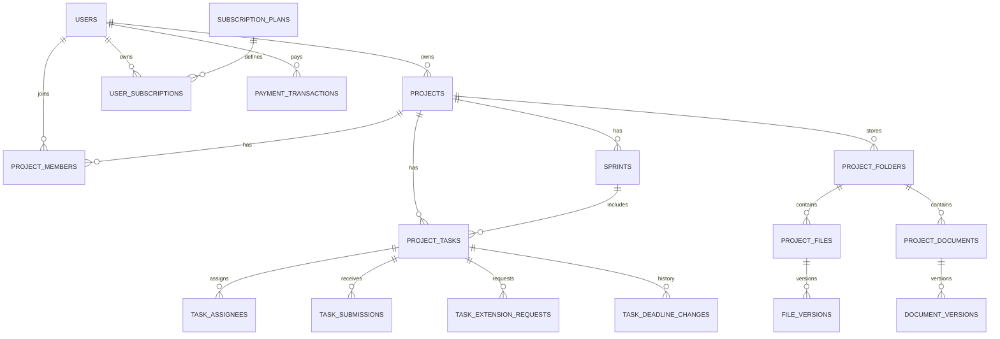

# DATABASE DESIGN

Database: **PostgreSQL / Neon**  
ORM: **EF Core 10**  
Binary file: **Cloudinary**, không lưu BLOB trong SQL.

ERD mở bằng diagrams.net: [`DATABASE_ERD.drawio`](DATABASE_ERD.drawio)

## 1. Identity

### Users
`Id PK`, `Email UNIQUE`, `NormalizedEmail`, `PasswordHash?`, `DisplayName`, `AvatarUrl?`, `Status`, `CreatedAt`, `UpdatedAt`

### ExternalLogins
`Id PK`, `UserId FK`, `Provider`, `ProviderUserId`, `CreatedAt`  
Unique `(Provider, ProviderUserId)`.

### RefreshTokens
`Id PK`, `UserId FK`, `TokenHash`, `ExpiresAt`, `RevokedAt?`, `DeviceInfo?`, `CreatedAt`

## 2. Project

### Projects
`Id PK`, `OwnerUserId FK`, `Name`, `Description`, `StartAt?`, `EndAt?`, `Status`, `CreatedAt`, `UpdatedAt`, `DeletedAt?`

### ProjectInvitations
`Id PK`, `ProjectId FK`, `InvitedEmail`, `InvitedUserId?`, `InvitedByUserId`, `RoleId`, `TokenHash`, `Status`, `ExpiresAt`, `RespondedAt?`, `CreatedAt`

### ProjectMembers
`Id PK`, `ProjectId FK`, `UserId FK`, `Status`, `JoinedAt`  
Unique `(ProjectId, UserId)`.

## 3. Project RBAC

### ProjectRoles
`Id PK`, `ProjectId?`, `Code`, `Name`, `IsSystemRole`, `CreatedAt`

### Permissions
`Id PK`, `Code UNIQUE`, `Name`, `Module`

### ProjectRolePermissions
`RoleId FK`, `PermissionId FK`, `Effect`  
Unique `(RoleId, PermissionId)`.

### ProjectMemberRoles
`ProjectMemberId FK`, `RoleId FK`  
Unique `(ProjectMemberId, RoleId)`.

## 4. Agile

### Sprints
`Id PK`, `ProjectId FK`, `Name`, `Goal?`, `StartAt`, `EndAt`, `Status`, `CreatedByUserId`, `CreatedAt`, `ClosedAt?`

## 5. Task

### ProjectTasks
`Id PK`, `ProjectId FK`, `SprintId? FK`, `Title`, `Description`, `Priority`, `Status`, `OriginalDueAt?`, `EffectiveDueAt?`, `CreatedByUserId`, `CreatedAt`, `UpdatedAt`, `CompletedAt?`, `ExpiredAt?`, `DeletedAt?`

### TaskAssignees
`TaskId FK`, `ProjectMemberId FK`, `AssignedByUserId`, `AssignedAt`  
Unique `(TaskId, ProjectMemberId)`.

### TaskAcceptanceCriteria
`Id PK`, `TaskId FK`, `Content`, `SortOrder`

### TaskExtensionRequests
`Id PK`, `TaskId FK`, `RequestedByUserId`, `RequestedDueAt`, `Reason`, `Status`, `ReviewedByUserId?`, `ReviewedAt?`, `ReviewNote?`, `CreatedAt`

### TaskDeadlineChanges
`Id PK`, `TaskId FK`, `OldDueAt`, `NewDueAt`, `ChangeType`, `CountsAsLate`, `Reason`, `ChangedByUserId`, `ExtensionRequestId?`, `CreatedAt`

### TaskSubmissions
`Id PK`, `TaskId FK`, `SubmittedByUserId`, `AttemptNumber`, `Description?`, `SubmittedAt`, `Status`, `ReviewedByUserId?`, `ReviewedAt?`, `ReviewFeedback?`

### TaskSubmissionLinks
`Id PK`, `SubmissionId FK`, `Url`, `LinkType`, `Title?`

### TaskSubmissionFiles
`Id PK`, `SubmissionId FK`, `ProjectFileId FK`, `FileVersionId FK`

## 6. Storage

### ProjectFolders
`Id PK`, `ProjectId FK`, `ParentFolderId? FK self`, `Name`, `CreatedByUserId`, `CreatedAt`, `UpdatedAt`, `DeletedAt?`

### ProjectFiles
`Id PK`, `ProjectId FK`, `FolderId FK`, `Name`, `MimeType`, `CurrentVersionId?`, `OwnerUserId`, `CreatedAt`, `UpdatedAt`, `DeletedAt?`

### FileVersions
`Id PK`, `ProjectFileId FK`, `VersionNumber`, `CloudinaryPublicId`, `CloudinaryResourceType`, `SizeBytes`, `Checksum?`, `UploadedByUserId`, `CreatedAt`, `ChangeNote?`

### ProjectDocuments
`Id PK`, `ProjectId FK`, `FolderId FK`, `Title`, `OwnerUserId`, `CurrentVersionId?`, `CreatedAt`, `UpdatedAt`, `DeletedAt?`

### DocumentVersions
`Id PK`, `DocumentId FK`, `VersionNumber`, `Content`, `ContentFormat`, `EditedByUserId`, `CreatedAt`, `ChangeNote?`

### FolderAccessRules
`Id PK`, `FolderId FK`, `PrincipalType`, `RoleId?`, `ProjectMemberId?`, `CanView`, `CanCreate`, `CanUpload`, `CanEdit`, `CanDelete`, `CreatedByUserId`, `CreatedAt`

Constraint: đúng một trong `RoleId` hoặc `ProjectMemberId`.

## 7. Notification

### Notifications
`Id PK`, `UserId FK`, `Type`, `Title`, `Message`, `EntityType?`, `EntityId?`, `IsRead`, `CreatedAt`, `ReadAt?`

## 8. Analytics

### MemberPerformanceMetrics
`Id PK`, `ProjectId FK`, `ProjectMemberId FK`, `PeriodStart`, `PeriodEnd`, `AssignedTaskCount`, `CompletedTaskCount`, `OnTimeTaskCount`, `LateTaskCount`, `EarlyTaskCount`, `ReworkCount`, `ApprovedSubmissionCount`, `Score`, `CalculatedAt`

### ProjectMetricSnapshots
`Id PK`, `ProjectId FK`, `SnapshotAt`, `TotalTasks`, `DoneTasks`, `OverdueTasks`, `ActiveMembers`, `CompletionRate`, `StorageBytes`

Raw truth vẫn là Task/Submission/Deadline; snapshot chỉ để chart/query nhanh.

## 9. Billing

### SubscriptionPlans
`Id PK`, `Code UNIQUE`, `Name`, `Price`, `Currency`, `BillingPeriod`, `MaxOwnedProjects`, `MaxStorageBytes`, `IsActive`, `CreatedAt`, `UpdatedAt`

### UserSubscriptions
`Id PK`, `UserId FK`, `PlanId FK`, `Status`, `StartedAt`, `ExpiresAt?`, `AutoRenew`, `CreatedAt`

### PaymentTransactions
`Id PK`, `UserId FK`, `SubscriptionId?`, `PlanId FK`, `Provider`, `ProviderTransactionId?`, `Amount`, `Currency`, `Status`, `IdempotencyKey`, `CreatedAt`, `PaidAt?`

### PaymentWebhookEvents
`Id PK`, `Provider`, `ExternalEventId`, `PayloadHash`, `ReceivedAt`, `ProcessedAt?`, `Status`

## 10. Integration / Support / Audit

### ProjectExternalLinks
`Id PK`, `ProjectId FK`, `Type`, `Url`, `Title?`, `CreatedByUserId`, `CreatedAt`

### Feedbacks
`Id PK`, `UserId? FK`, `Category`, `Subject`, `Content`, `Status`, `AssignedAdminUserId?`, `CreatedAt`, `ResolvedAt?`

### AuditLogs
`Id PK`, `ActorUserId?`, `ProjectId?`, `Action`, `EntityType`, `EntityId`, `BeforeJson?`, `AfterJson?`, `IpAddress?`, `CreatedAt`

## 11. Index quan trọng

- `ProjectMembers(ProjectId, UserId)` UNIQUE
- `ProjectTasks(ProjectId, Status)`
- `ProjectTasks(EffectiveDueAt, Status)`
- `TaskAssignees(ProjectMemberId, TaskId)`
- `TaskSubmissions(TaskId, SubmittedAt)`
- `ProjectFolders(ProjectId, ParentFolderId)`
- `FileVersions(ProjectFileId, VersionNumber)` UNIQUE
- `Notifications(UserId, IsRead, CreatedAt)`
- `AuditLogs(ProjectId, CreatedAt)`
- `PaymentTransactions(Provider, ProviderTransactionId)`

## 12. Quan hệ tóm tắt

