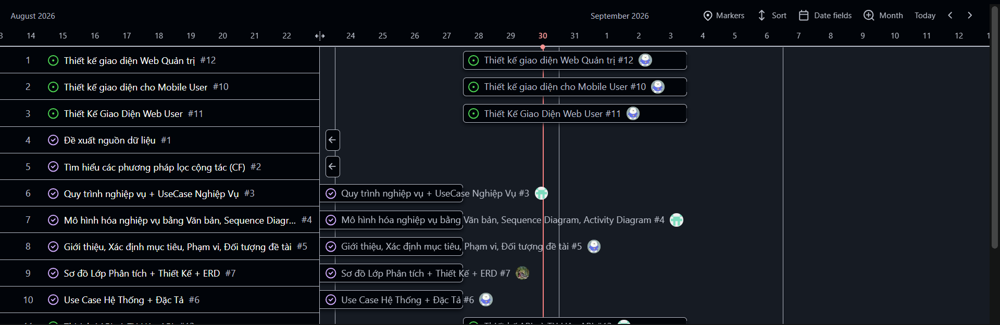
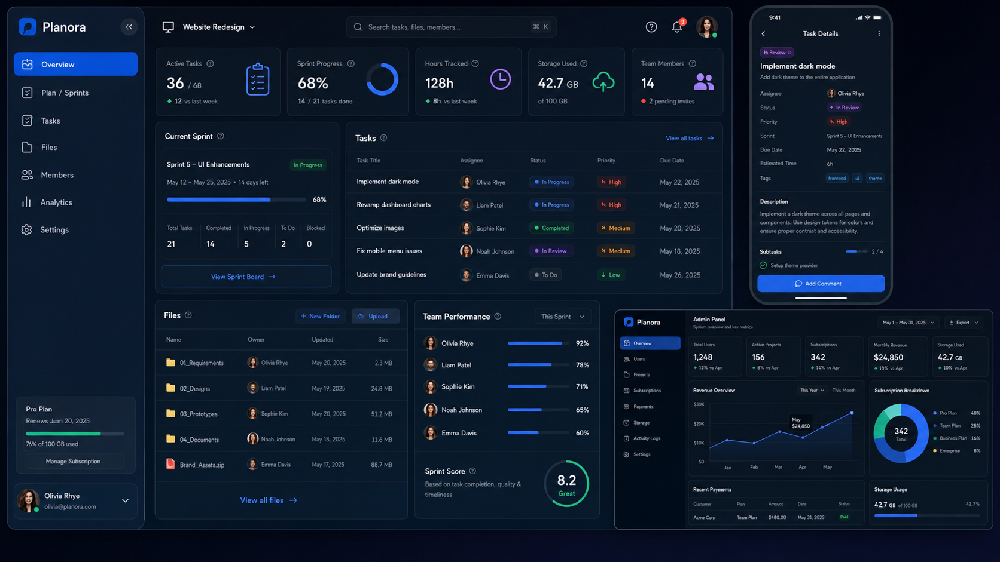
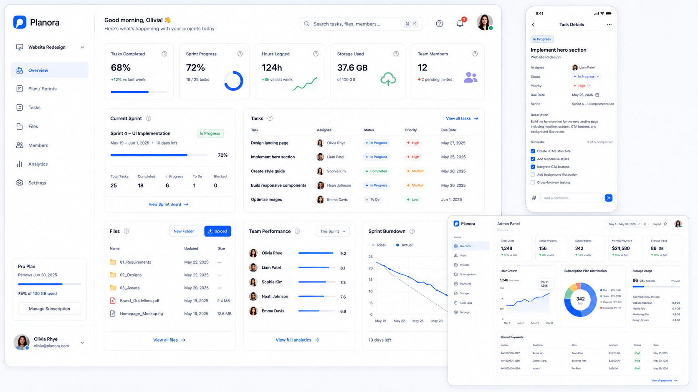
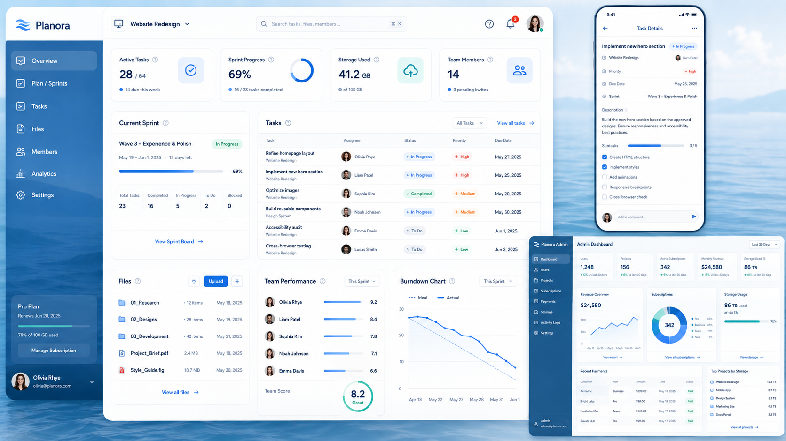

Mô tả chức năng hệ thống
- Authentication
    - Login bằng Google/tên đăng nhập/email đăng ký
    - Register
        - Đồng ý điều khoản
        - Nhập email
        - Tên hiển thị
        - Tên đăng nhập
        - Pass
        - Confirm pass
    - Forgot pass
        - Nhập email đăng ký
        - Gửi mã xác nhận về Email (ko áp dụng với login bằng google)
        - Đổi mật khẩu sau khi nhập đúng mã xác nhận
        - Hiển thị thời gian mã tồn tại
    - Validation
        - Mật khẩu trên 8 ký tự, có ít nhất 1 ký tự đặc biệt
        - Hiển thị thanh đánh giá độ mạnh của mật khẩu
        - Bắt email ko hợp lệ. chỉ chấp nhận @gmail
    - Ghi nhớ đăng nhập tồn tại trong 30 days và tự clear
- Tạo kế hoạch
    - Tiêu đề Project
    - Mô tả
    - Tạo sprint (Mặc định là Sprint + số)
        - Thời gian của Sprint
        - Có thể tạo nhiều Sprint
    - Thêm thành viên trong mục quản lí thành viên dựa vào email đăng kí (có hiển thị ra user nếu mail matching)
        - Hiển thị trạng thái lời mời
        - Sau khi thành viên join
            - Cấu hình quyền cho thành viên (bảng quyền xem phía dưới)
    - Kick thành viên kèm lí do, thành viên bị kick nhận được thông báo kèm lí do
    - Tạo task
        - Tiêu đề
        - Nội dung Task (hỗ trợ markdown)
        - Kết quả nộp (cho phép file, link, ảnh)
            - Yêu cầu nộp có thể được leader tùy chọn, ví dụ chỉ đc nộp word, hoặc excel, pdf,... ppt
        - Task thuộc sprint nào?
        - Thời gian task (Ko quá 1 thời gian 1 sprint)
        - Chọn thành viên để giao
            - Thành viên được giao nhận email nội dung Task và thông báo realtime trên web/ứng dụng có thể vào web để xem chi tiết
        - Mức độ quan trọng của Task (góp phần quan trọng đánh giá của người được giao, ví dụ người đc giao làm trễ thì sẽ bị ảnh hưởng lớn nên trừ điểm nhiều hơn)
        - Loại Task
            - Task liên quan đến tài liệu, fix bug, chức năng, testing hay gì đó....
    - Edit Task (người có quyền)
        - Bất cứ ai tác động vô task đều lưu lại lịch sử chỉnh sửa, ghi nhận luôn người hoàn thành task là ai, thời gian(giờ việt nam)
- Folder thư mục chung của project
    - Hiển thị dạng cấp thư mục phân cấp
    - Dung lượng thư mục, file bên trong
    - Đối với Task thuộc Loại Document
    - Thành viên nộp kết quả và submit được hệ thống tự động lưu vào thư mục Document chung của Project
        - Tài liệu được thêm có thêm thông tin về việc được thêm từ task nào
    - Chỉ có Leader mới có quyền đổi tên thư mục, tên file, xóa thư mục.
    - Có thể trực tiếp xem file trên web hoặc tải về để xem
    - Các thành viên mặc định có quyền được xem, download nhưng ko đc sửa,xóa
- Biều đồ hiển thị xem và thống kê
    - Dạng Roadmap 
    - Xem thêm các dạng hiển thị phía dưới
- Gói sử dụng
    - Xây dựng giới hạn theo bảng mô tả phía dưới
    - Lưu ý về việc Collab, 1 user đã đạt hạn mức vẫn có thể join vào dự án của người khác được, mọi thao tác upload hay gì đó của bất kì thành viên nào chỉ ảnh hưởng đến quota của người tạo Project
- Về cơ chế Thanh toán
    - Chuyển khoản ngân hàng tự động qua SePay webhook
- Profile của mỗi user
    - Avatar cho phép upload hoặc lấy từ Avatar khi login google
    - Đổi tên hiển thị
    - Thống kê về số lượng project tham gia
    - Xem quota, hiển thị cảnh báo khi sắp hết quota, hiển thị thanh dung lượng quota
    - Xem gói sử dụng, lịch sử thanh toàn được xác nhận, thời hạn sử dụng còn lại, hủy gói (về lại free), Gửi phản hồi, góp ý, yêu cầu hoàn tiền
- Hoàn tiền
    - Kết nối kênh chat realtime quản trị viên để trao đổi về việc hoàn tiền. Đoạn chat kết thúc sẽ bị xóa mềm
- Trang quản trị
    - Quản lí, chỉnh sửa gói
    - Quản lí user, ban, xóa tài khoản
    - Tất cả thao tác xóa gói, xóa project của user,xóa sprint, các thao tác xóa gây ảnh hưởng lớn đến bảng khác đều là xóa mềm. Tuy nhiên thao tác như xóa tài liệu upload, xóa task, những bảng con và ko gây ảnh hướng đến bảng khác thì xóa vĩnh viễn. Hiển thị log hệ thống cho phép phục hồi các thao tác xóa mềm
    - Xem thống kê, biểu đồ, doanh thu người mua gói
    - Có thêm các loại thống kê như bảng mô tả dưới
- Validation tổng
    - Mọi thao tác thực hiện thay đổi đều cần sự đồng ý của người dùng
    - Trong cài đặt của user có 1 chức năng gọi là hướng dẫn sử dụng cho phép user xem được hướng dẫn sử dụng về quy trình 1 project diễn ra như nào? Tạo ảnh kèm chú thích trên hình, đây là 1 trang hướng dẫn độc lập
- Cài đặt, cho phép user thay đổi nền hiển thị và ngôn ngữ hiển thị
    - Có 3 tông nền: Tối, Sáng, Yên bình (Màu xanh biển chủ đạo) (Xem chi tiết 3 mẫu giao diện ở dưới)
    - Ngôn ngữ hỗ trợ: Tiếng Anh + Tiếng Việt
    - Xem điều khoản sử dụng trong cài đặt
- Trang bảo trì
    - Vì hệ thống sẽ được deploy cho nên ở trang quản trị có chức năng bật bảo trì lúc này ở user khi đăng nhập sẽ được thông báo là Hệ thống đang báo trì, vui lòng quay lại sau.
- Giao diện
    - Font chữ ko bản quyền
    - Tạo Logo thương hiệu đổi màu mỗi khi chuyển đổi nền giao diện (gợi ý: tạo 3 logo giống nhau khác màu tùy theo giao diện)
**Các nhóm thống kê với web quản trị**
| Nhóm                   | Thống kê nên có                                                                                                   |
| ---------------------- | ----------------------------------------------------------------------------------------------------------------- |
| **Người dùng**         | Tổng user, user mới hôm nay/tuần/tháng, active user, tài khoản bị khóa, đăng ký bằng Google/Facebook              |
| **Project**            | Tổng project, Active/Completed/Paused/Cancelled, project mới theo thời gian, số project trung bình/user           |
| **Task & Sprint**      | Tổng task, task Done/In Progress/Expired, tổng sprint đang Active, completion rate toàn hệ thống                  |
| **Storage**            | Tổng dung lượng Cloudinary đang dùng, tăng trưởng storage, top account/project dùng nhiều storage, số file upload |
| **Subscription**       | Số Free/Pro/VIP, tỷ lệ chuyển Free → Pro/VIP, subscription sắp hết hạn, subscription bị hủy                       |
| **Payment**            | Doanh thu hôm nay/tháng, giao dịch Success/Pending/Failed, doanh thu BankTransfer, refund nếu sau này có     |
| **System Health**      | API requests, error rate, response time, failed background jobs, notification failures                            |
| **Feedback / Support** | Feedback mới, đang xử lý, đã giải quyết, category phổ biến                                                        |
| **Security / Abuse**   | login fail, rate-limit hit, upload bị từ chối, account/project bị flag, webhook payment lỗi                       |

**Ma trận gói đề xuất**    
| Tính năng / Giới hạn            |        **Free** |         **Pro** |          **VIP** |
| ------------------------------- | --------------: | --------------: | ---------------: |
| **Project được sở hữu**         |           **1** |          **10** |           **50** |
| Tham gia Project của người khác | Không giới hạn* | Không giới hạn* |  Không giới hạn* |
| Thành viên / Project            |               5 |              25 |              100 |
| **Storage / Project**           |      **500 MB** |        **5 GB** |        **20 GB** |
| Tổng Storage các Project sở hữu |          500 MB |           20 GB |           100 GB |
| File tối đa                     |           25 MB |          100 MB |           250 MB |
| Upload/ngày                     |          200 MB |            2 GB |            10 GB |
| Số file upload/ngày             |              50 |             300 |            1.000 |
| File version                    |  5 version/file | 30 version/file | 100 version/file |
| Folder / Subfolder              |               ✅ |               ✅ |                ✅ |
| Internal Document               |               ✅ |               ✅ |                ✅ |
| File/Document version history   |          Cơ bản |               ✅ |                ✅ |
| Task / Sprint / Backlog         |               ✅ |               ✅ |                ✅ |
| Kanban / List                   |               ✅ |               ✅ |                ✅ |
| Calendar                        |               ✅ |               ✅ |                ✅ |
| Roadmap / Timeline              |               ✅ |               ✅ |                ✅ |
| Gantt                           |               ❌ |               ✅ |                ✅ |
| Task Submission                 |               ✅ |               ✅ |                ✅ |
| Extension Request               |               ✅ |               ✅ |                ✅ |
| Deadline History                |               ✅ |               ✅ |                ✅ |
| Notification                    |               ✅ |               ✅ |                ✅ |
| Realtime SignalR                |               ✅ |               ✅ |                ✅ |
| Default Role                    |               ✅ |               ✅ |                ✅ |
| Custom Role                     |               ❌ |  5 Role/Project |   Không giới hạn |
| Folder Permission nâng cao      |               ❌ |               ✅ |                ✅ |
| Audit Log                       |          7 ngày |         90 ngày |            1 năm |
| Analytics cơ bản                |               ✅ |               ✅ |                ✅ |
| Member Performance              |         Hạn chế |               ✅ |                ✅ |
| Analytics nâng cao              |               ❌ |               ✅ |                ✅ |
| Export report                   |               ❌ |               ✅ |                ✅ |
| GitHub Repository Link          |               ✅ |               ✅ |                ✅ |
| Xem Branch / Commit / PR        |               ❌ |               ✅ |                ✅ |
| Tạo Branch từ Task              |               ❌ |               ✅ |                ✅ |
| Link Task ↔ Branch/PR           |               ❌ |               ✅ |                ✅ |
| GitHub Webhook Sync             |               ❌ |               ✅ |                ✅ |
| Priority support                |               ❌ |               ❌ |                ✅ |

**Bảng các dạng thống kê tùy chọn hiển thị của 1 project**
| Dạng xem                  | Dùng để làm gì                                          | Mức nên có |
| ------------------------- | ------------------------------------------------------- | ---------: |
| **List / Table View**     | Xem toàn bộ task theo dạng bảng, filter/sort nhanh      |      ⭐⭐⭐⭐⭐ |
| **Kanban Board**          | Kéo thả task giữa Todo → In Progress → Submitted → Done |      ⭐⭐⭐⭐⭐ |
| **Sprint Board**          | Chỉ xem task thuộc Sprint hiện tại                      |      ⭐⭐⭐⭐⭐ |
| **Backlog View**          | Task chưa được đưa vào Sprint                           |      ⭐⭐⭐⭐⭐ |
| **Calendar View**         | Xem task theo deadline/ngày                             |       ⭐⭐⭐⭐ |
| **Timeline / Roadmap**    | Xem task/sprint trải dài theo thời gian                 |      ⭐⭐⭐⭐⭐ |
| **Gantt Chart**           | Giống timeline nhưng nhấn mạnh dependency và tiến độ    |       ⭐⭐⭐⭐ |
| **Dashboard**             | KPI tổng quan project                                   |      ⭐⭐⭐⭐⭐ |
| **Workload View**         | Xem ai đang bị giao quá nhiều task                      |       ⭐⭐⭐⭐ |
| **Analytics View**        | Biểu đồ tiến độ, đúng hạn, trễ hạn, contribution        |      ⭐⭐⭐⭐⭐ |
| **Activity / Audit View** | Ai đã sửa gì, assign ai, đổi deadline lúc nào           |        ⭐⭐⭐ |
| **Milestone View**        | Xem các mốc quan trọng của project                      |        ⭐⭐⭐ |
| **Dependency View**       | Quan hệ task A phải xong trước task B                   |         ⭐⭐ |

    
**Bảng Quyền mặc định và cho phép modify**
| Quyền                    | Member mặc định | Ghi chú                         |
| ------------------------ | :-------------: | ------------------------------- |
| `project.view`           |        ✅        | Xem Project                     |
| `project.edit`           |        ❌        | Không sửa thông tin Project     |
| `project.delete`         |        ❌        | Không xóa Project               |
| `project.manage_members` |        ❌        | Không thêm/xóa thành viên       |
| `project.manage_roles`   |        ❌        | Không chỉnh quyền               |
| `project.view_analytics` |      ✅/tùy      | Có thể cho xem                  |
| `sprint.view`            |        ✅        | Xem Sprint                      |
| `sprint.create`          |        ❌        | Không tạo Sprint                |
| `sprint.edit`            |        ❌        | Không sửa Sprint                |
| `sprint.close`           |        ❌        | Không đóng Sprint               |
| `task.view`              |        ✅        | Xem Task                        |
| `task.create`            |        ❌        | Không tạo Task                  |
| `task.edit`              |        ❌        | **Quan trọng**                  |
| `task.assign`            |        ❌        | Không đổi assignee              |
| `task.submit`            |        ✅        | Chỉ submit task được giao       |
| `task.review`            |        ❌        | Không approve/rework người khác |
| `task.extend_deadline`   |        ❌        | Không tự đổi deadline           |
| `task.request_extension` |        ✅        | Chỉ được gửi yêu cầu gia hạn    |

3 Mẫu giao diện theo 3 phong cácg
- Tối

- Sáng

- Yên bình (xanh biển chủ đạo)

