# WORKFLOWS

## 1. Auth

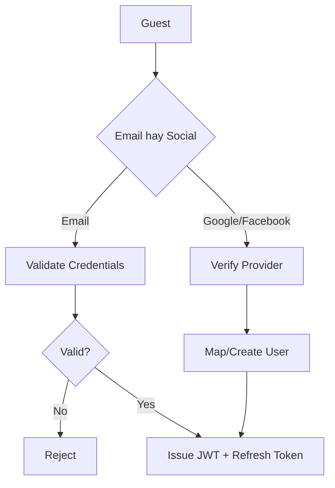

## 2. Create Project

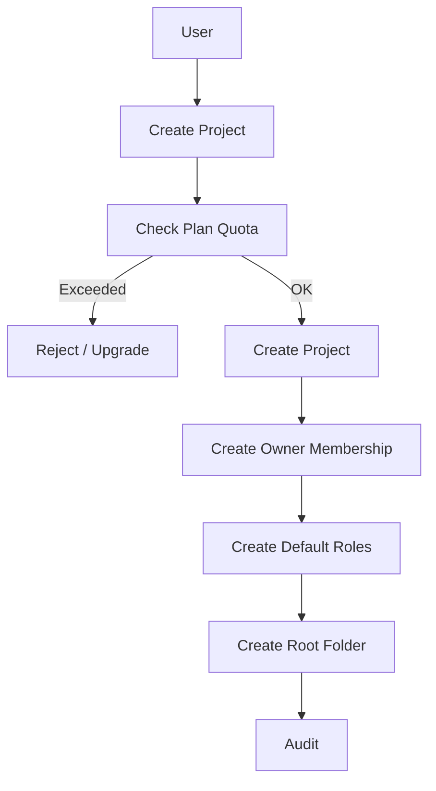

## 3. Invite Member

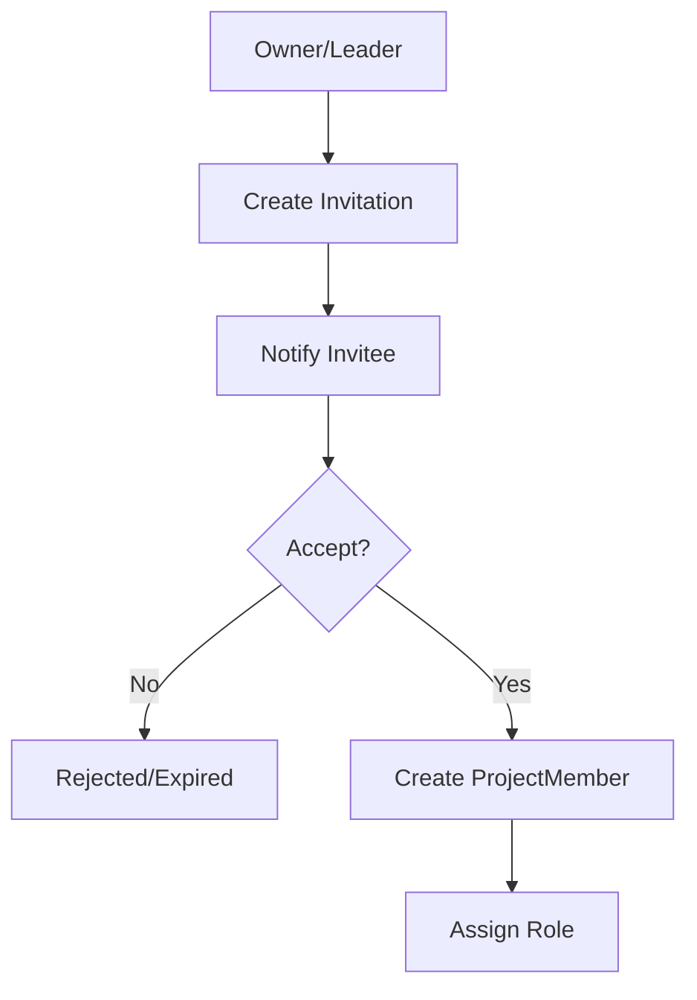

## 4. Sprint

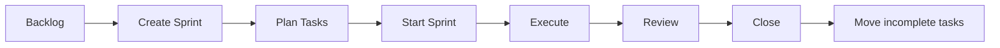

## 5. Task lifecycle

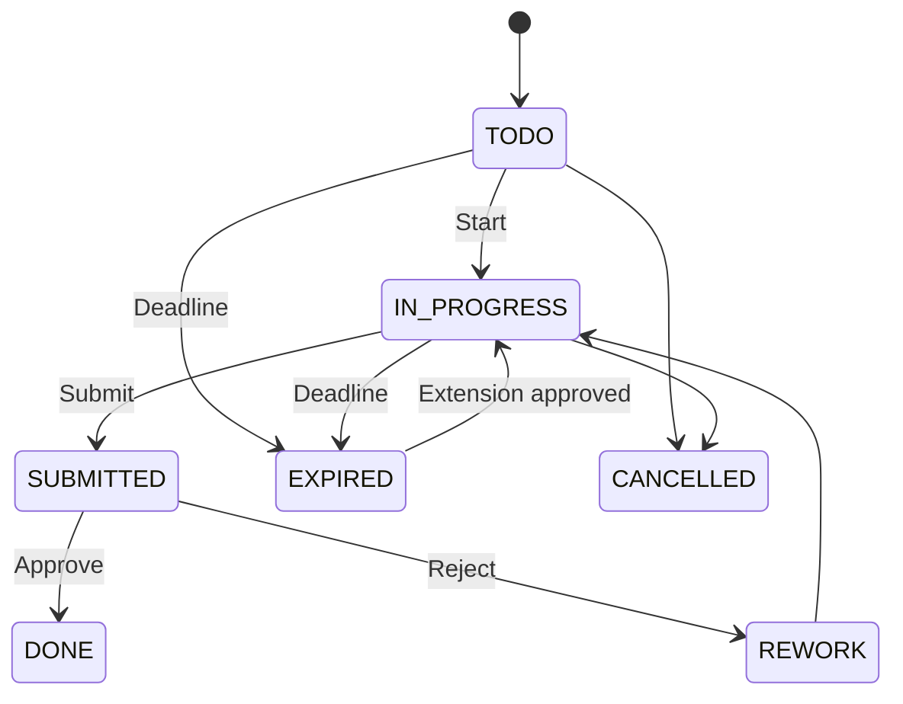

## 6. Auto-expire

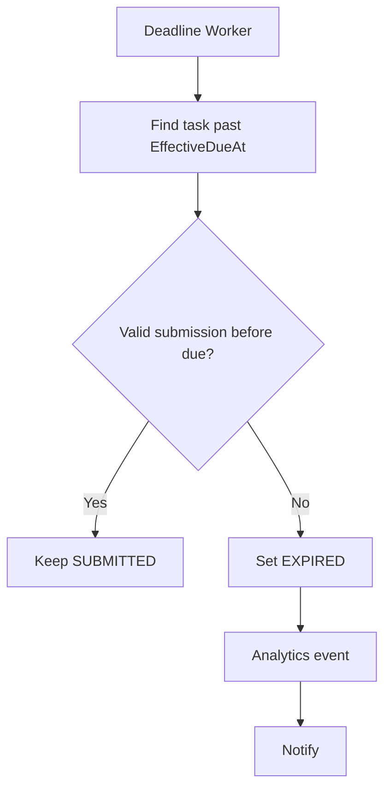

## 7. Member Request Extension

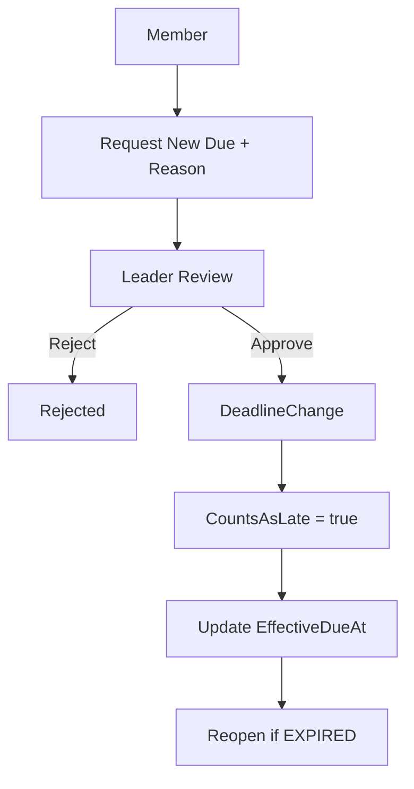

## 8. Leader Direct Extension

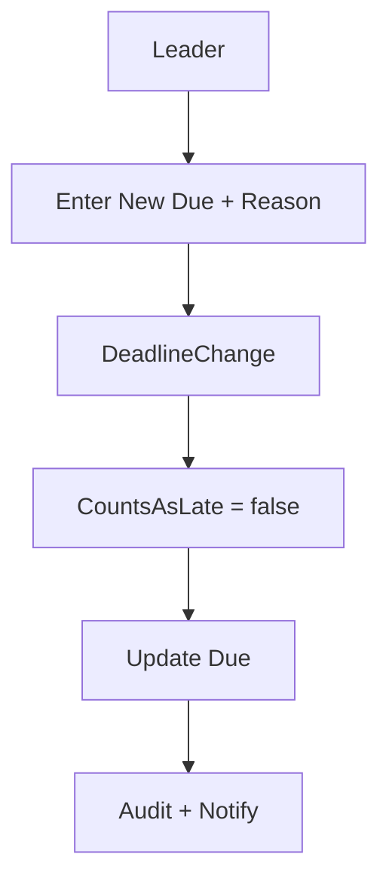

## 9. Submit Task Result

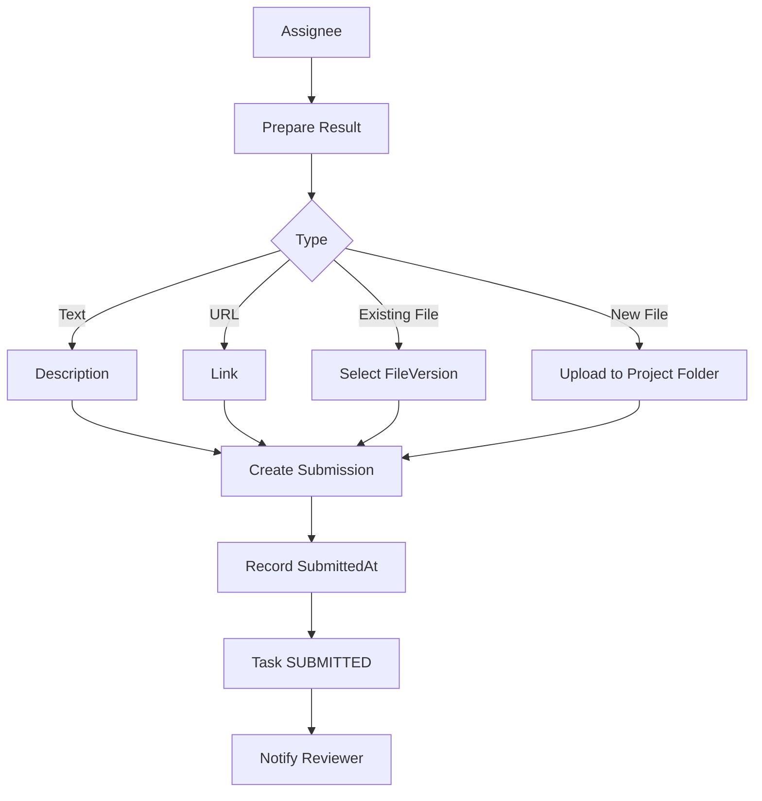

## 10. Review

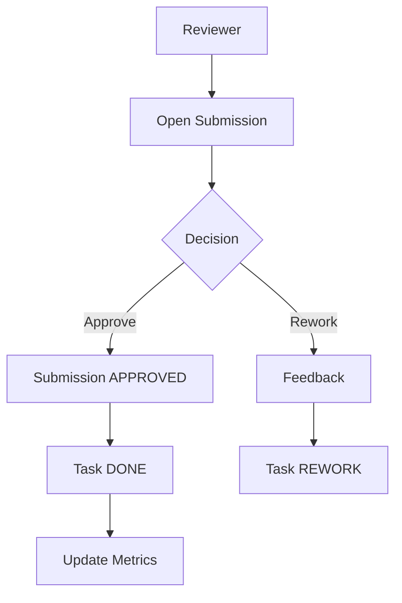

## 11. Storage Access

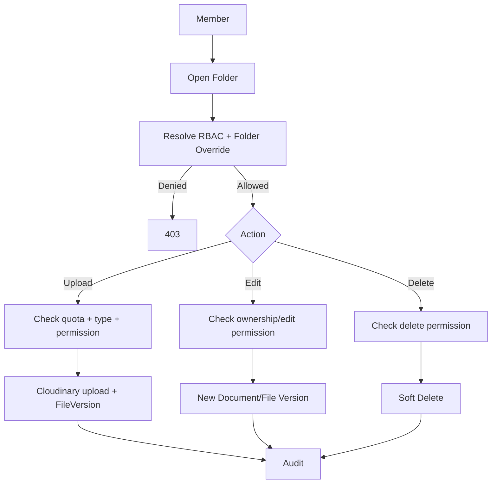

## 12. Folder Permission

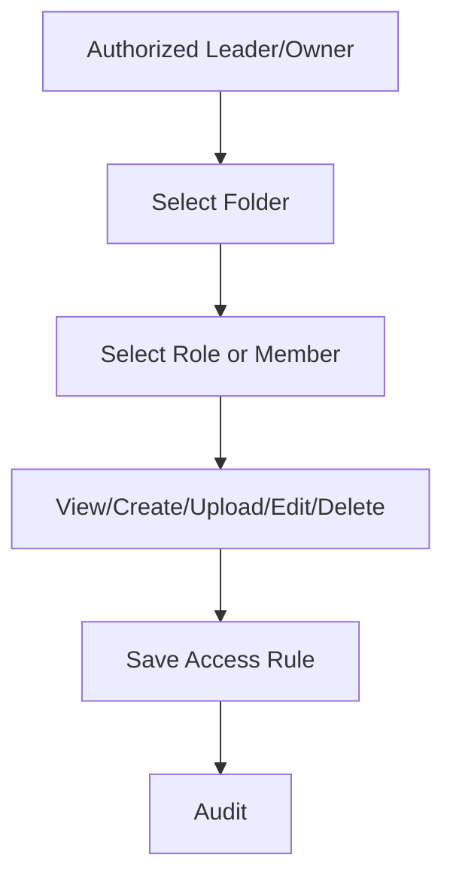

## 13. Analytics

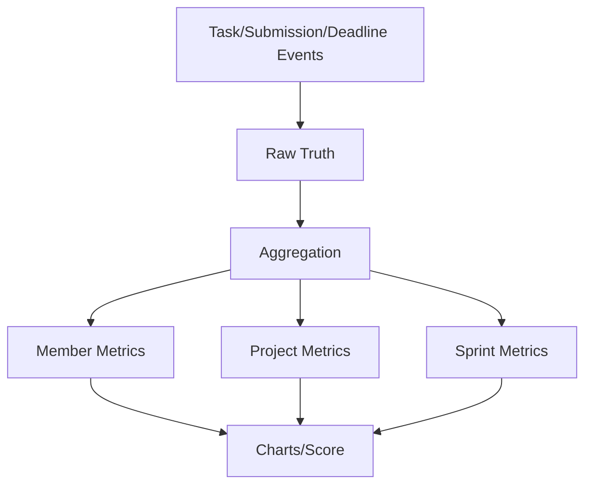

## 14. Payment

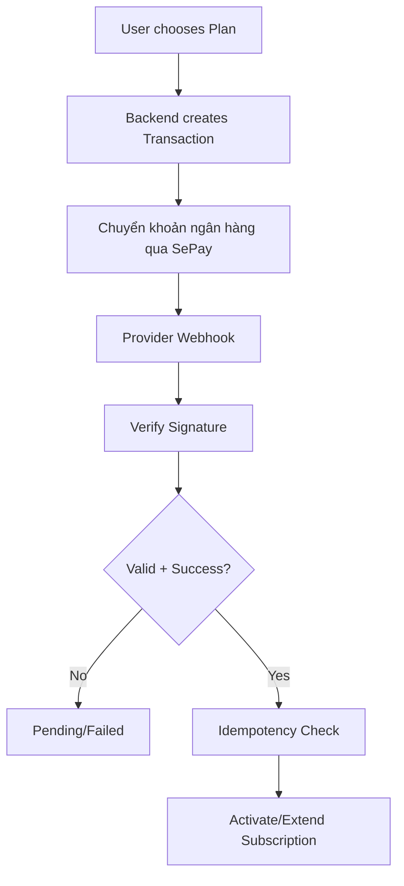

## 15. GitHub link

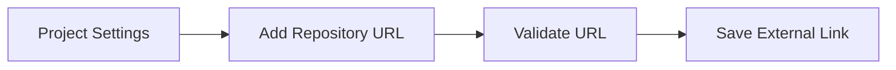

## 16. Admin

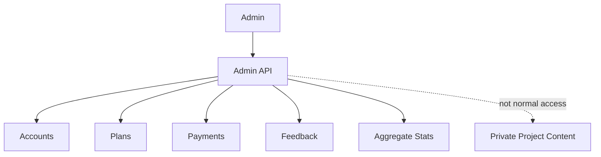
